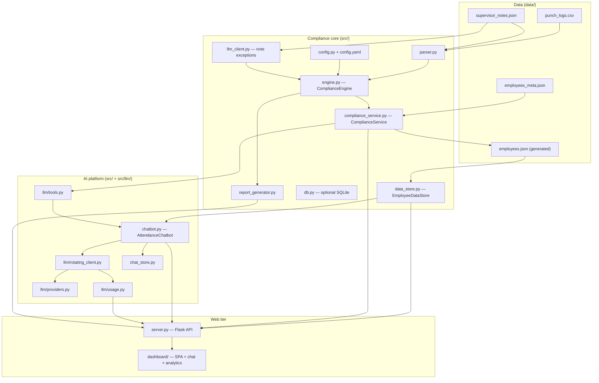
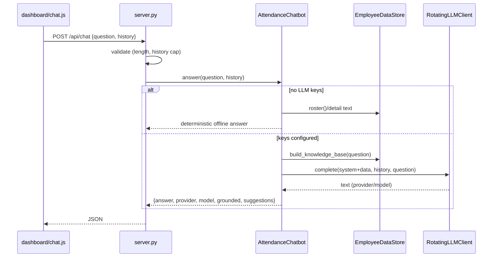

# Architecture

The platform has three cooperating layers wrapped by a web tier. The guiding
principle: **numbers are deterministic, language is AI.** The compliance engine
computes every point balance day-by-day; LLMs are used only to interpret
free-text supervisor notes and to answer natural-language questions.

---

## 1. Component map

---

## 2. The two data paths

The system deliberately has two entry points over the **same** source data
(`punch_logs.csv` + `supervisor_notes.json`):

1. **Batch / report path** — `main.py` → `parser` → `engine` →
   `report_generator` → `reports/*.md`. Evaluates each employee as of their last
   punch and writes IRM briefs + warning letters.
2. **Interactive path** — `server.py` → `chatbot` + `data_store` /
   `compliance_service`. Serves the dashboard and chat, evaluating balances as of
   the reference "today" (**2026-05-31**).

Historically these used different datasets; they are now unified: `employees.json`
is **generated** from the CSV by `scripts/build_employees.py` (see
[DATA_MODEL.md](DATA_MODEL.md)), so the dashboard and the engine never drift.

---

## 3. Request flows

### 3.1 Grounded chat (`POST /api/chat`)

### 3.2 Streaming chat (`POST /api/chat/stream`)

`server.py` wraps `chatbot.stream()` in a `text/event-stream`. Each token is one
SSE `data:` frame `{"delta": "..."}`, terminated by `{"done": true, provider,
model}`. If a provider can't stream, the client yields the full answer as one
chunk, so the endpoint behaves identically offline.

### 3.3 Tool-calling (F-40)

When enabled, `AttendanceChatbot` gives the model a small toolset that maps 1:1 to
`ComplianceService` (contract 3.2): `get_employee`, `roster`, `list_by_status`,
`lowest_points`, `infractions`. The model calls tools, the chatbot dispatches them
against the real (or stub) service, appends results, and loops up to
`MAX_TOOL_ROUNDS` before forcing a final answer. This scales past dumping the
whole dataset into the prompt.

---

## 4. LLM rotation & resilience

`RotatingLLMClient` (ported from the adbrain orchestrator) provides:

- **Provider order** from `LLM_PROVIDER_ORDER` (google → groq → openrouter → cerebras).
- **Per-provider key pools** with a **round-robin cursor** so load spreads evenly.
- **429 cooldown** — a rate-limited key is parked for 60s and skipped.
- **Failover** across keys then providers; it raises `AllProvidersFailedError`
  only after *every* combination fails, or `NoLLMKeysError` when nothing is
  configured (which triggers the offline fallback upstream).
- **Three surfaces**: `complete`, `stream`, `complete_tools`, each recording token
  usage into `llm/usage.py`.

Providers (`GeminiProvider`, `OpenAICompatibleProvider`) redact the API key from
every error/log string and treat 429/5xx/401/403 as retryable.

---

## 5. Security posture

- **No secrets in code** — keys come only from `.env`; `.env` is gitignored.
- **Key redaction** — provider errors run through a `key=REDACTED` scrubber.
- **XSS-safe UI** — `dashboard` escapes all interpolated values (`esc()`), and
  `chat.js` renders an escape-first, allow-listed subset of Markdown.
- **Input bounds** — the API caps question length (2000) and history (12 turns)
  and validates employee IDs against `^EMP\d{2,6}$`.
- **Optional auth** — token-gated dashboard + API with a dev-bypass flag
  (see [DEPLOYMENT.md](DEPLOYMENT.md)).
- **Audit log** — `chat_store.py` records questions + referenced employee IDs
  (never full answers) to `data/chat_log.jsonl`.

---

## 6. Interface contracts

These seams let the layers evolve independently (full definitions in
[PARALLEL_WORK_PLAN.md](PARALLEL_WORK_PLAN.md) §3):

- **3.1 `EmployeeDataStore`** — read-only roster/detail/knowledge-base access.
- **3.2 `ComplianceService`** — live-computed records + queries (the tool surface).
- **3.3 `AttendanceChatbot`** — `answer()` / `stream()`.
- **3.4 `usage_snapshot()`** — LLM usage metering.
- **3.5 HTTP routes** — owned by the web tier, wiring the above.

See also: [DATA_MODEL.md](DATA_MODEL.md), [API.md](API.md), [TESTING.md](TESTING.md).
