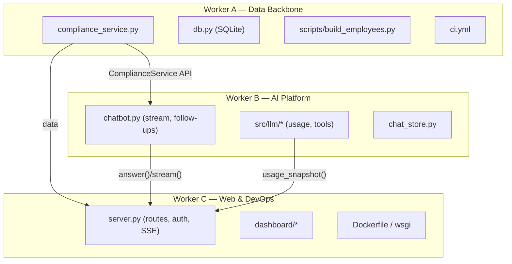

# Parallel Work Plan — 3 Workers

This plan splits the [feature backlog](FEATURES.md) into **three independent
tracks** designed to run **in parallel with minimal merge conflicts**. Each track
has exclusive file ownership; cross-track needs are met through **stable interface
contracts** (below), not by editing each other's files.

> Spin up three Copilot chats. Paste the matching prompt from
> [§5 Ready-to-paste prompts](#5-ready-to-paste-worker-prompts) into each.

---

## 1. Track Summary

| Track | Owner theme | Features |
| :---- | :---------- | :------- |
| **A — Data & Compliance Backbone** | Unify data, engine-as-service, DB, CI | F-30, F-31, F-32, F-39, F-42 (SQLite foundation) |
| **B — AI / LLM Platform & Chatbot** | Streaming, tools, usage, persistence | F-33 (backend), F-34, F-35, F-36, F-40 |
| **C — Web, Dashboard & DevOps** | API, UX, auth, analytics, Docker | F-33 (frontend), F-37, F-38, F-45, F-50, F-52 |



---

## 2. File Ownership Matrix

**Rule: only edit files your track owns.** If you need a change in another
track's file, code against the [interface contracts](#3-interface-contracts) and
leave the wiring to that owner.

| Path | Owner | Others may |
| :--- | :---- | :--------- |
| `src/compliance_service.py` (new) | A | import |
| `src/db.py` (new), `scripts/` (new) | A | — |
| `src/data_store.py` | A | import (stable API) |
| `data/*.csv`, `data/*.json` | A | read |
| `.github/workflows/ci.yml` (new) | A | — |
| `src/llm/**` | B | import |
| `src/chatbot.py` | B | import |
| `src/chat_store.py` (new) | B | — |
| `server.py` | C | — (B/A expose funcs, C wires) |
| `dashboard/**` | C | — |
| `Dockerfile`, `wsgi.py`, `gunicorn.conf.py` (new) | C | — |
| `tests/test_<yourarea>.py` | each | add own files only |

### Shared files (coordinate — append-only)
- `requirements.txt` — **append one dependency per line**; resolve conflicts by
  taking the **union**. Never reorder existing lines.
- `docs/**` — each worker writes a **new** file `docs/notes-<track>.md`; do not
  edit shared docs. Worker C consolidates into `README.md` at the end.
- `.env.example` — append new keys at the end only.

---

## 3. Interface Contracts

These are the seams between tracks. Agree on them first; then each side can build
against the contract independently (use stubs where the real impl isn't ready).

### 3.1 `EmployeeDataStore` (owned by A, consumed by B & C) — DO NOT BREAK
```python
class EmployeeDataStore:
    def all(self) -> dict[str, dict]: ...
    def get(self, emp_id: str) -> dict | None: ...
    def roster(self) -> list[dict]: ...                  # id,name,role,department,current_points,warning_status
    def find_mentioned(self, question: str) -> list[str]: ...
    def roster_summary_text(self) -> str: ...
    def employee_detail_text(self, emp_id: str) -> str: ...
    def build_knowledge_base(self, question: str | None = None) -> str: ...
```

### 3.2 `ComplianceService` (owned by A, new — enables F-31 & B's tools F-40)
```python
class ComplianceService:
    def get_employee(self, emp_id: str) -> dict: ...          # live-computed record
    def roster(self) -> list[dict]: ...
    def list_by_status(self, status: str) -> list[dict]: ...
    def lowest_points(self, n: int = 1) -> list[dict]: ...
    def infractions(self, emp_id: str, year: int | None = None) -> list[dict]: ...
```
A ships this backed by `ComplianceEngine`. B's function-calling tools (F-40) call
only these methods.

### 3.3 Chatbot (owned by B, consumed by C)
```python
class AttendanceChatbot:
    def answer(self, question: str, history: list[dict] | None = None) -> dict: ...
    # returns {answer, provider, model, grounded}
    def stream(self, question: str, history=None) -> Iterator[str]: ...   # F-33: yields text chunks
```

### 3.4 LLM usage (owned by B, consumed by C for `/api/health`)
```python
def usage_snapshot() -> dict: ...   # {requests, prompt_tokens, completion_tokens, by_provider}
```

### 3.5 HTTP routes (owned by C) — B/A provide the Python, C owns the wiring
- `POST /api/chat/stream` → SSE of `chatbot.stream(...)`
- `GET  /api/usage` → `usage_snapshot()`
- `GET  /api/employees/<id>` → `ComplianceService.get_employee(id)`

---

## 4. Coordination & Merge Strategy

1. **Contracts first:** in the first commit, each worker lands the stubs/signatures
   from §3 they own, so the others can integrate immediately.
2. **Branch per track:** `feat/track-a-data`, `feat/track-b-ai`, `feat/track-c-web`.
3. **Small PRs**, one feature ID per PR where possible.
4. **Keep `pytest -q` green** on every PR; add tests in your own `tests/` files.
5. **Merge order when interdependent:** A's contracts → B → C. Non-dependent work
   merges anytime.
6. **Never commit `.env`**; only update `.env.example`.

---

## 5. Ready-to-paste Worker Prompts

Copy the whole block for each worker into a separate Copilot chat in this repo.

---

### 5.1 Worker A — Data & Compliance Backbone

```
You are Worker A on the blue_collar_attendance_compliance repo. Work ONLY on the
"Data & Compliance Backbone" track. First read docs/PROJECT_DOCUMENTATION.md,
docs/FEATURES.md, and docs/PARALLEL_WORK_PLAN.md.

YOUR FEATURES: F-30, F-31, F-32, F-39, F-42 (SQLite foundation only).

FILES YOU OWN (only edit these + your own new files):
- src/compliance_service.py (new), src/db.py (new), scripts/build_employees.py (new)
- src/data_store.py (you may extend, but you MUST keep its public API stable —
  see contract 3.1 in the work plan)
- data/punch_logs.csv, data/supervisor_notes.json, data/employees.json
- .github/workflows/ci.yml (new)
- tests/test_compliance_service.py, tests/test_build_employees.py (new)

DO NOT TOUCH: src/llm/**, src/chatbot.py, server.py, dashboard/**.
SHARED (append-only, never reorder): requirements.txt, .env.example.

TASKS:
1. F-32: Extend data/punch_logs.csv with realistic punch histories for all 10
   employees (EMP101–EMP110) consistent with dashboard data.js/employees.json.
2. F-31: Create src/compliance_service.py implementing ComplianceService
   (contract 3.2) backed by ComplianceEngine + parser + config. get_employee()
   returns a record shaped like employees.json entries but with LIVE-computed
   current_points/history/warnings/freeze_periods.
3. F-30: Create scripts/build_employees.py that runs ComplianceService over the
   CSV/notes and writes data/employees.json (canonical). Make it idempotent and
   add a `--check` mode that fails if the committed JSON is stale (for CI).
4. F-42: Create src/db.py with a minimal SQLite layer (employees, punches, notes
   tables) and a loader from CSV/JSON. Keep it optional/behind a flag; do not
   break the JSON path.
5. F-39: Add .github/workflows/ci.yml running `pip install -r requirements.txt`
   and `pytest -q` on push/PR.

CONSTRAINTS:
- Keep EmployeeDataStore's public API (contract 3.1) unchanged.
- Keep all existing tests green; add tests for every new module.
- No network or API keys required for your tests.
- Follow existing code style (type hints, small focused functions, minimal comments).

DEFINITION OF DONE: pytest -q passes; build_employees.py regenerates a valid
employees.json; ComplianceService returns live-computed records; CI workflow runs
the suite. Open a PR titled "Track A: data backbone (F-30/31/32/39/42)".
```

---

### 5.2 Worker B — AI / LLM Platform & Chatbot

```
You are Worker B on the blue_collar_attendance_compliance repo. Work ONLY on the
"AI / LLM Platform & Chatbot" track. First read docs/PROJECT_DOCUMENTATION.md,
docs/FEATURES.md, and docs/PARALLEL_WORK_PLAN.md.

YOUR FEATURES: F-33 (backend/generator only), F-34, F-35, F-36, F-40.

FILES YOU OWN (only edit these + your own new files):
- src/llm/** (env.py, providers.py, rotating_client.py, __init__.py)
- src/chatbot.py
- src/chat_store.py (new), src/llm/usage.py (new)
- tests/test_llm_usage.py, tests/test_chat_stream.py, tests/test_chat_store.py (new)
  (you may also extend tests/test_rotating_client.py and tests/test_chatbot.py)

DO NOT TOUCH: server.py, dashboard/**, src/data_store.py, src/compliance_service.py,
data/**. Consume them via their contracts (3.1–3.2) only.
SHARED (append-only, never reorder): requirements.txt, .env.example.

TASKS:
1. F-36: Add src/llm/usage.py with usage_snapshot() (contract 3.4). Record
   requests + token usage per provider inside RotatingLLMClient.complete().
2. F-33 (backend): Add RotatingLLMClient.stream() and AttendanceChatbot.stream()
   (contract 3.3) yielding text chunks. Implement provider streaming for Gemini
   and OpenAI-compatible; fall back to yielding the full answer if a provider
   can't stream. DO NOT wire HTTP — Worker C owns server.py.
3. F-34: Add src/chat_store.py to persist conversations + a query audit log to
   data/chat_log.jsonl (append-only, no PII beyond employee IDs). Wire optional
   logging into AttendanceChatbot.
4. F-35: Have the chatbot optionally return `suggestions: list[str]` (2–3
   follow-up questions) in its answer dict.
5. F-40: Add a tool/function-calling layer so the model can call
   ComplianceService methods (contract 3.2) instead of relying only on
   full-context grounding. Use a stub ComplianceService if Worker A's isn't merged
   yet, matching contract 3.2 exactly.

CONSTRAINTS:
- Preserve the offline fallback path (no keys ⇒ deterministic answers).
- Keep RotatingLLMClient's rotation/cooldown/failover semantics and existing tests.
- Never log or print API keys. Secrets only via .env.
- Keep all existing tests green; add tests using fake providers (no network).

DEFINITION OF DONE: pytest -q passes; stream() yields chunks; usage_snapshot()
reports per-provider tokens; chat_store writes an audit log; tool-calling works
against a ComplianceService (real or stub). Open a PR titled "Track B: AI platform
(F-33/34/35/36/40)".
```

---

### 5.3 Worker C — Web, Dashboard & DevOps

```
You are Worker C on the blue_collar_attendance_compliance repo. Work ONLY on the
"Web, Dashboard & DevOps" track. First read docs/PROJECT_DOCUMENTATION.md,
docs/FEATURES.md, and docs/PARALLEL_WORK_PLAN.md.

YOUR FEATURES: F-33 (frontend + routes), F-37, F-38, F-45, F-50, F-52.

FILES YOU OWN (only edit these + your own new files):
- server.py (all routes/wiring)
- dashboard/** (index.html, index.css, app.js, chat.js, new assets)
- Dockerfile (new), wsgi.py (new), gunicorn.conf.py (new)
- tests/test_server.py, tests/test_api.py (new)

DO NOT TOUCH: src/llm/**, src/chatbot.py internals, src/compliance_service.py,
src/data_store.py, data/**. Import and wire them via contracts 3.1–3.5 only.
SHARED (append-only, never reorder): requirements.txt, .env.example.

TASKS:
1. F-33 (frontend): Add POST /api/chat/stream (SSE) that streams
   AttendanceChatbot.stream() (contract 3.3); update dashboard/chat.js to render
   streaming tokens. Keep the non-streaming /api/chat as fallback.
2. F-36 wiring: Add GET /api/usage returning usage_snapshot() (contract 3.4) and
   surface it in the chat status line / a small footer.
3. F-37: Add a per-employee "Explain these points" button in the dashboard that
   opens the assistant pre-filled with a question about the selected employee.
4. F-38: Add an "Export to IRM brief" action on a chat answer (POST to a new
   route that calls report_generator) and offer a download.
5. F-45: Add an Analytics view/tab (department comparisons, at-risk counts,
   points distribution) computed from /api/employees.
6. F-50: Add simple auth (env-configured token or basic session) protecting the
   API and dashboard; keep a dev-bypass flag like the rest of the app.
7. F-52: Add a Dockerfile + wsgi.py + gunicorn config to run the app in
   production; document `docker run` usage in your docs/notes-c.md.

CONSTRAINTS:
- Keep chat rendering XSS-safe (escape-first, like the current chat.js).
- Validate/bound all request inputs (question length, history size).
- Do not implement chatbot/LLM logic here — call the contracts.
- Keep all existing tests green; add server/API tests (use a fake chatbot/service
  so tests need no network).

DEFINITION OF DONE: pytest -q passes; streaming chat works in the browser; /api/usage
and analytics render; auth gates the app with a dev bypass; `docker build` produces
a runnable image served by gunicorn. Open a PR titled "Track C: web & devops
(F-33/37/38/45/50/52)".
```

---

## 6. Conflict-Avoidance Checklist (all workers)

- [ ] I only edited files my track owns.
- [ ] I coded against the §3 contracts for anything cross-track.
- [ ] `requirements.txt` / `.env.example` changes are append-only.
- [ ] I added tests in my own `tests/` files; `pytest -q` is green.
- [ ] I did not commit `.env` or any secret.
- [ ] My PR title names my track and feature IDs.
