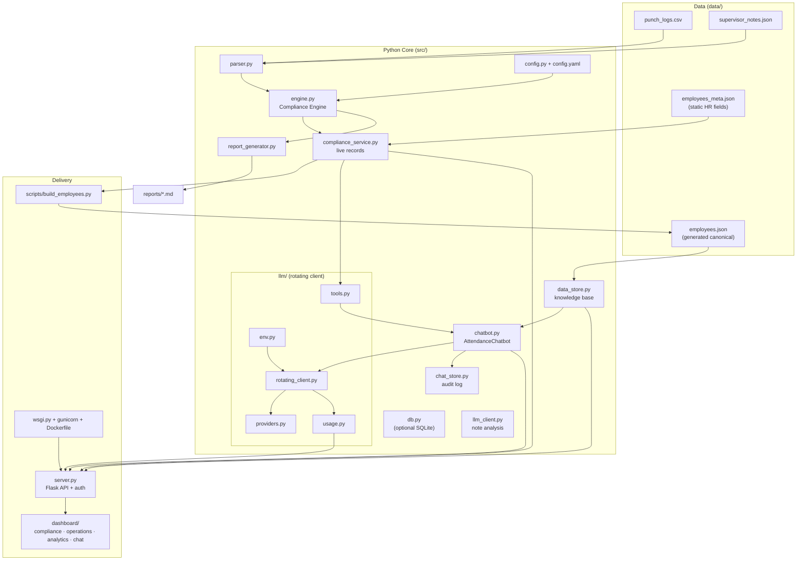
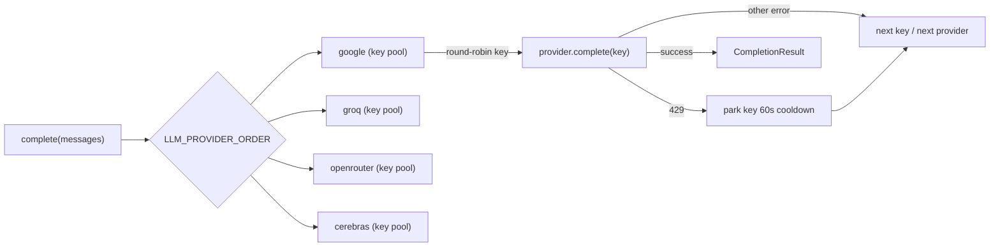

# Workforce Attendance Compliance — Project Documentation

A deep reference for the attendance compliance engine, the canonical data layer,
the multi-provider LLM stack, the grounded attendance chatbot, and the operations
dashboard.

---

## 1. Overview

This project automates a **"No-Fault" attendance policy** for a blue-collar
workforce. It has three cooperating layers:

1. **Deterministic compliance engine** — replays each employee's punch history
   day-by-day and computes point balances, roll-ons, freezes, warnings and
   terminations exactly per policy.
2. **AI note analysis + chatbot** — an LLM interprets unstructured supervisor
   notes for policy exceptions (FMLA, overrides), and a grounded chatbot answers
   natural-language questions about any employee's attendance — with **streaming
   responses**, **function-calling tools**, follow-up suggestions and an audit log.
3. **Presentation & delivery** — an operations dashboard (compliance, operations
   and **analytics** tabs) plus a Flask JSON API with **SSE streaming**, optional
   **token/session auth**, and a **Docker/gunicorn** deployment path.

The system is deliberately split so the **numbers are always deterministic**
(engine) while the **language understanding is AI** (notes + chat).

### Platform capabilities at a glance
- **Live-computed compliance** via `ComplianceService` — points are recomputed
  from punches, not stored ([§4.7](#47-srccompliance_servicepy--complianceservice-f-31)).
- **Multi-provider LLM** with key-pool rotation, 429 cooldown, failover, streaming,
  tool-calling and usage metering ([§6](#6-llm-key-rotation-streaming--tooling)).
- **Single source of truth:** `employees.json` is generated from source data by
  `scripts/build_employees.py` (idempotent; CI checks staleness).
- **Deployable:** `Dockerfile` + `wsgi.py` + gunicorn for production; auth is off
  by default for local/offline use.

---

## 2. Architecture



### One source of truth, two consumers

Both paths derive from the same source data (`punch_logs.csv` +
`supervisor_notes.json` + `employees_meta.json`):

- **Batch/report path:** `main.py` → `parser.py` → `engine.py` →
  `report_generator.py`. Produces Markdown reports in `reports/`.
- **Interactive path:** `server.py` → `chatbot.py` + `data_store.py` /
  `compliance_service.py`. Powers the dashboard and chat.

`scripts/build_employees.py` runs the engine over the source data and writes the
canonical `data/employees.json` (F-30). `ComplianceService` computes the same
records **live** for the API and the chatbot's tools (F-31), so batch and
interactive views agree. Balances are evaluated as of **2026-05-31**.

---

## 3. Directory Structure

```
blue_collar_attendance_compliance/
├── config.yaml              # Policy rules & thresholds
├── main.py                  # Batch compliance report CLI
├── server.py                # Flask API: dashboard + chat + auth + streaming
├── wsgi.py                  # WSGI entrypoint (gunicorn/uWSGI)
├── gunicorn.conf.py         # Production server config
├── Dockerfile               # Container build (F-52)
├── requirements.txt         # + flask, requests, python-dotenv, gunicorn
├── .env.example             # Template for LLM keys + auth (copy to .env)
├── pytest.ini
├── .github/workflows/ci.yml # CI: pytest + data-staleness check (F-39)
├── scripts/
│   └── build_employees.py   # Regenerate canonical employees.json (F-30)
├── data/
│   ├── punch_logs.csv        # Raw punches — engine input (all 10 employees)
│   ├── supervisor_notes.json # Unstructured notes (exemptions)
│   ├── employees_meta.json   # Static HR fields (name/role/balances) — hand-edited
│   └── employees.json        # GENERATED canonical dataset (do not hand-edit)
├── src/
│   ├── config.py            # PolicyConfig loader
│   ├── parser.py            # CSV/JSON ingestion
│   ├── engine.py            # Deterministic ComplianceEngine
│   ├── compliance_service.py# Live-computed records (F-31, contract 3.2)
│   ├── db.py                # Optional SQLite layer (F-42)
│   ├── llm_client.py        # LLMComplianceClient (note exceptions, litellm + mock)
│   ├── report_generator.py  # IRM briefs + warning letters
│   ├── data_store.py        # EmployeeDataStore + knowledge-base builder
│   ├── chatbot.py           # AttendanceChatbot (grounded + tools + streaming)
│   ├── chat_store.py        # Conversation/query audit log (F-34)
│   └── llm/                 # Multi-provider rotating LLM client
│       ├── env.py           # Key-pool + model env parsing
│       ├── providers.py     # Gemini + OpenAI-compatible (+ streaming, tools)
│       ├── rotating_client.py # Round-robin, cooldown, failover, stream, tools
│       ├── tools.py         # Function-calling toolset (F-40)
│       └── usage.py         # Token/usage metering (F-36)
├── dashboard/
│   ├── index.html           # Dashboard + chat widget markup
│   ├── index.css            # Styles (incl. chat + analytics)
│   ├── app.js               # Dashboard rendering + "Explain points" deep-link
│   ├── analytics.js         # Analytics tab (F-45)
│   ├── data.js              # Bundled fallback dataset (file:// mode)
│   ├── chat.js              # Chat widget: streaming, usage, export
│   └── login.html           # Auth login page (F-50)
├── reports/                 # Generated Markdown (gitignored)
└── tests/                   # pytest suite (132 tests)
```

---

## 4. Component Reference

### 4.1 `src/config.py` — `PolicyConfig`
Loads `config.yaml` into typed attributes: `start_points`, `roll_off_months`,
`freeze_trigger`, `freeze_duration_months`, warning thresholds, the `infractions`
code→points map, and `lo_freebies`. `get_deduction(code)` returns the point cost
of an infraction code.

### 4.2 `src/parser.py` — `DataIngestion`
- `load_punch_logs(csv_path)` → normalized `DataFrame` (`employee_id`, `date`,
  `base_code`, `actual_code`). Validates required columns; coerces dates.
- `load_supervisor_notes(json_path)` → list of `{employee_id, date, note}`.

### 4.3 `src/engine.py` — `ComplianceEngine`
The deterministic heart. `process_employee_compliance(emp_id, punch_df, notes)`
replays the timeline day-by-day and returns `current_points`, `history`,
`warnings`, `freeze_periods`. See [§5](#5-compliance-policy--engine-logic).

### 4.4 `src/llm_client.py` — `LLMComplianceClient`
Analyzes a single supervisor note for a policy exception, returning a Pydantic
`ExceptionAnalysis` (`is_exempt`, `reason`, `exception_type`). Uses `litellm`
when an API key is present; otherwise a deterministic keyword mock (FMLA, "let it
slide", protected sick). This keeps the batch pipeline and its tests fully
offline-capable.

### 4.5 `src/report_generator.py` — `ComplianceReportGenerator`
Renders `generate_irm_brief(...)` (Investigative Review Meeting brief with audit
trail table) and `generate_warning_letter(...)` as Markdown.

### 4.6 `src/data_store.py` — `EmployeeDataStore`
Loads canonical `employees.json` and exposes `all()`, `get(id)`, `roster()`,
`find_mentioned(question)`, `roster_summary_text()`, `employee_detail_text(id)`
and `build_knowledge_base(question)` (the chatbot's grounding context). This is
**contract 3.1** — stable and read-only.

### 4.7 `src/compliance_service.py` — `ComplianceService` (F-31)
Turns raw punches + notes + `employees_meta.json` into **live-computed** records
shaped like `employees.json` entries (compliance fields recomputed by
`ComplianceEngine`, evaluated as of 2026-05-31). Public API (**contract 3.2**):
`get_employee(id)`, `all_records()`, `roster()`, `list_by_status(status)`,
`lowest_points(n)`, `infractions(id, year)`. This is the seam the chatbot's tools
and `/api/employees/<id>` consume.

### 4.8 `src/db.py` — Optional SQLite layer (F-42)
A minimal, optional persistence layer (employees/punches/notes) with a loader
from the CSV/JSON sources. The JSON path remains the default; the DB is opt-in.

### 4.9 `src/llm/` — Rotating multi-provider client (+ tools, usage)
See [§6](#6-llm-key-rotation-streaming--tooling). Per-provider key pools,
round-robin rotation, 429 cooldown, provider failover, **streaming** (`stream()`),
**function-calling** (`complete_tools()` + `tools.py`) and **usage metering**
(`usage.py`).

### 4.10 `src/chatbot.py` — `AttendanceChatbot`
`answer(question, history)` returns `{answer, provider, model, grounded,
suggestions}` via one of three paths:
- **Grounded** (default): injects the full data digest as context.
- **Tool-calling** (F-40, when `use_tools`/a toolset is set): the model calls
  `ComplianceService` tools and answers from the results.
- **Offline** (no keys): deterministic lookups for common intents.
`stream(question, history)` yields text chunks (F-33). Follow-up **suggestions**
(F-35) and optional **audit logging** via `ChatStore` (F-34) are built in.

### 4.11 `src/chat_store.py` — `ChatStore` (F-34)
Append-only conversation/query audit log (`log_query(...)`) writing JSONL. Stores
only the question, a result summary and referenced employee IDs — never keys or
raw prompts. Logging never breaks answering.

### 4.12 `src/llm/tools.py` — `ComplianceToolset` (F-40)
Provider-agnostic JSON tool `specs()` + `dispatch()` mapping 1:1 to
`ComplianceService` (contract 3.2). Ships a `StubComplianceService` (backed by
`EmployeeDataStore`) so tools work before the live service is wired.

### 4.13 `src/llm/usage.py` — Usage metering (F-36)
Thread-safe, process-global counters for requests and prompt/completion tokens
per provider. `usage_snapshot()` (**contract 3.4**) powers `/api/usage`.

### 4.14 `scripts/build_employees.py` — Data builder (F-30)
Runs `ComplianceService` over the source data and writes canonical
`employees.json` (deterministic; sorted keys). `--check` fails if the committed
file is stale (used by CI); `--sqlite <path>` also populates the DB.

### 4.15 `server.py` — Flask API
Serves the dashboard and the JSON API (auth, streaming, export, analytics data).
See [§8](#8-web-api-reference).

### 4.16 `dashboard/` — UI
Compliance, operations and **analytics** tabs plus the floating **Attendance
Assistant**. `chat.js` streams answers (SSE), shows usage, offers **export to IRM
brief** and an **"Explain these points"** deep-link; it hydrates from
`/api/employees` and falls back to bundled `data.js` for `file://`. `login.html`
handles auth when enabled.

### 4.17 Deployment — `wsgi.py`, `gunicorn.conf.py`, `Dockerfile` (F-52)
Production entrypoint (`wsgi:app`) served by threaded gunicorn workers (threads
matter for SSE). The Docker image runs the app with env-configurable port and
concurrency.

---

## 5. Compliance Policy & Engine Logic

All employees start at **7.0 points**. Configurable in `config.yaml`.

### 5.1 Infraction codes

| Code   | Meaning                     | Points |
| :----- | :-------------------------- | :----- |
| `skps` | Protected sick (FMLA-like)  | 0.0    |
| `skp`  | Unprotected sick            | 1.0    |
| `LTDR` | Personal absence            | 1.0    |
| `IANS` | No call / no show           | 3.0    |
| `LTNC` | Late-reported absence       | 2.0    |
| `LT`   | Late > 14 min               | 0.5    |
| `Lo`   | Late ≤ 14 min               | 0.5    |

### 5.2 Special rules
- **Lo freebies:** first **3** `Lo` infractions in a rolling **12 months** cost 0.
- **Consecutive `skp`:** consecutive sick days group into **one** 1.0 deduction.
- **Note exceptions:** a supervisor note may exempt an infraction (FMLA, approved,
  "let it slide") via `LLMComplianceClient`.

### 5.3 Roll-on (recovery)
Each deduction **rolls back on 12 months** after the infraction date. Balance is
capped at the 7.0 starting maximum.

### 5.4 Warnings & termination
- ≤ **2.0** → Written Warning
- ≤ **1.0** → Termination Warning **+ a 4-month roll-on freeze**
- ≤ **0.0** → Termination

### 5.5 The 4-month freeze
When the balance hits ≤ 1.0, a 4-month freeze starts. New deductions still apply,
but **no roll-ons execute during the freeze**; queued roll-ons run once it ends.

---

## 6. LLM Key Rotation, Streaming & Tooling

The rotating client (`src/llm/`) is a faithful Python port of the adbrain
TypeScript orchestrator, extended with streaming, function-calling and usage
metering.



### Mechanics
- **Key pools** are comma-separated env values (e.g. `GOOGLE_AI_API_KEYS=k1,k2`).
  Empty disables a provider.
- **Round-robin cursor per provider** spreads load across keys.
- **429 → 60s cooldown** parks a key so it is skipped on subsequent calls.
- **Failover** proceeds across keys then across providers in `LLM_PROVIDER_ORDER`.
- **Providers:** `GeminiProvider` (key as query param, `systemInstruction` +
  `contents`) and `OpenAICompatibleProvider` (Bearer token, OpenAI chat shape —
  serves Groq, OpenRouter, Cerebras).
- **Models are env-configurable:** `GEMINI_MODEL`, `GROQ_MODEL`,
  `OPENROUTER_MODEL`, `CEREBRAS_MODEL`.

### Beyond single completions
- **Streaming (F-33):** `stream(messages)` yields text chunks across the same
  rotation/failover; providers that can't stream yield the full answer once.
- **Function-calling (F-40):** `complete_tools(messages, specs)` returns any
  `tool_calls` the model requests; `ComplianceToolset.dispatch()` executes them
  against `ComplianceService`, and the loop feeds results back (capped at
  `MAX_TOOL_ROUNDS`).
- **Usage metering (F-36):** each successful call records token counts into
  `usage.py`; `usage_snapshot()` exposes per-provider totals.

`complete()` raises `NoLLMKeysError` if nothing is configured, or
`AllProvidersFailedError` only after every provider/key combination fails.

---

## 7. The Chatbot

`AttendanceChatbot` answers in one of three modes and always returns follow-up
`suggestions`:

- **Grounded (default):** the small dataset is rendered to compact text and
  injected as system context (employees named in the question are ordered first).
  No vector DB.
- **Tool-calling (F-40):** when enabled, the model calls `ComplianceService`
  tools (`get_employee`, `roster`, `list_by_status`, `lowest_points`,
  `infractions`) and answers only from the results — this scales past
  full-context grounding.
- **Offline (no keys):** deterministic lookups for common intents (specific
  employee, lowest/highest points, status filters).

**Streaming (F-33):** `stream()` yields the answer as chunks; with no keys it
yields the offline answer as a single chunk so callers get a uniform interface.

**Guardrails:** never invent data; cite employee IDs, dates and points; decline
unknowns. **Reference "today"** is **2026-05-31**. **Audit logging (F-34)** via
`ChatStore` is optional and never breaks answering.

---

## 8. Web API Reference

Base URL (dev): `http://127.0.0.1:5001`

| Method | Path | Body | Notes |
| :----- | :--- | :--- | :---- |
| GET  | `/` | — | Dashboard (auth-gated when a token is set) |
| GET  | `/login` | — | Login page (public) |
| POST | `/api/login` | `{token}` | Sets a session cookie |
| POST | `/api/logout` | — | Clears the session |
| GET  | `/api/employees` | — | Full canonical dataset |
| GET  | `/api/employees/<id>` | — | One employee (live via `ComplianceService`, else store) |
| GET  | `/api/health` | — | `{status, llm_configured, providers, auth_required}` (public) |
| GET  | `/api/usage` | — | `usage_snapshot()` (contract 3.4) |
| POST | `/api/chat` | `{question, history?}` | `{answer, provider, model, grounded, suggestions}` |
| POST | `/api/chat/stream` | `{question, history?}` | **SSE** of `chatbot.stream()` |
| POST | `/api/export/irm` | `{employee_id}` | Downloadable IRM brief (`text/markdown`) |

**Input bounds:** `question` ≤ 2000 chars; history truncated to the last 12 turns;
`employee_id` must match `EMP\d{2,6}`. `/api/chat` returns `400` for empty/oversized
questions and `502` if all providers fail.

**SSE frames** (`/api/chat/stream`):
```
data: {"delta": "partial text "}
data: {"delta": "more text"}
data: {"done": true, "provider": "google", "model": "gemini-2.0-flash"}
```
An error mid-stream emits `data: {"error": "..."}` then a `done` frame; the client
falls back to `/api/chat`.

**Auth (F-50):** off by default. Set `APP_AUTH_TOKEN` (and `APP_SECRET_KEY` to sign
cookies) to require a token; browsers are redirected to `/login`, API clients send
`Authorization: Bearer <token>` or `X-Auth-Token`. `AUTH_DEV_BYPASS=1` disables it
locally. `/api/health` stays public for liveness probes.

---

## 9. Configuration & Environment

- **Policy:** `config.yaml`.
- **Secrets:** `.env` (gitignored). Copy from `.env.example`:

```
GOOGLE_AI_API_KEYS=key1,key2
GROQ_API_KEYS=key1,key2
OPENROUTER_API_KEYS=
CEREBRAS_API_KEYS=
LLM_PROVIDER_ORDER=google,groq,openrouter,cerebras
GEMINI_MODEL=gemini-2.0-flash
GROQ_MODEL=openai/gpt-oss-20b
CHAT_MODEL_TEMPERATURE=0.2
```

Each `*_API_KEYS` is a **pool** the client rotates through.

**Auth (optional, off by default):** `APP_AUTH_TOKEN`, `APP_SECRET_KEY`,
`AUTH_DEV_BYPASS`. **Server tunables:** `PORT`, `WEB_CONCURRENCY`,
`GUNICORN_THREADS`, `GUNICORN_TIMEOUT`, `GUNICORN_LOG_LEVEL`.

---

## 10. Setup & Running

```bash
# 1. Install
python3 -m pip install -r requirements.txt

# 2. Configure keys
cp .env.example .env   # then edit .env

# 3. (Re)generate canonical data (after editing source data)
python3 scripts/build_employees.py           # writes data/employees.json
python3 scripts/build_employees.py --check    # CI: fail if stale

# 4a. Batch reports
python3 main.py        # writes reports/*.md

# 4b. Dashboard + chatbot (dev)
python3 server.py      # http://127.0.0.1:5001  (PORT env to override)

# 4c. Production (WSGI)
gunicorn -c gunicorn.conf.py wsgi:app
# or Docker:
docker build -t attendance-compliance . && \
  docker run --rm -p 5001:5001 --env-file .env attendance-compliance
```

Without keys, batch note-analysis and the chatbot both use deterministic
fallbacks, so the app still runs.

---

## 11. Testing

```bash
python3 -m pytest -q      # 132 tests, no network or keys required
```

Coverage: engine, parser, note-analysis mock, `ComplianceService`, the data
builder, the optional DB, the rotating client (rotation/cooldown/failover +
streaming + tools), usage metering, chat store, the chatbot (grounded/offline/
tools), and the HTTP API (routes, streaming + fallback, export, input bounds and
the auth matrix — all with an injected fake chatbot/service).

---

## 12. Security Notes

- `.env` is gitignored; keys are never committed. Usage metering and the audit
  log store counters/IDs only — never keys, prompts or response text.
- Chat responses are rendered with an **escape-first** markdown pass in `chat.js`
  to prevent XSS; the dashboard escapes interpolated values via `esc()`.
- The API validates and bounds all inputs (`question` length, history size,
  `employee_id` pattern).
- **Optional auth (F-50)** protects the API and dashboard (token/session with a
  dev bypass). Production runs under gunicorn/WSGI (F-52); the Flask dev server is
  for local use.

---

## 13. Known Limitations

- Full-context grounding and tool-calling suit tens of employees; very large
  rosters would benefit from retrieval/embeddings (F-41).
- The SQLite layer (F-42) is optional/foundational; JSON/CSV remain the default
  source and there is no Postgres/migration story yet.
- No HRIS/timeclock ingestion (F-43), proactive alerts (F-44), what-if simulation
  (F-46), PDF/e-sign (F-51) or i18n (F-53) yet.

See [FEATURES.md](FEATURES.md) for the full backlog and
[PARALLEL_WORK_PLAN.md](PARALLEL_WORK_PLAN.md) for how the delivered work was
split across three parallel workers.
